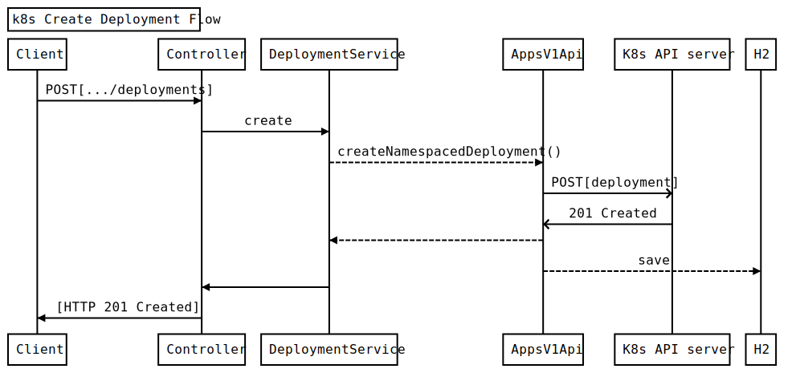

 
 
 
#  Spring Boot Kubernetes Gateway Project

### Prerequisites
* Java (>= 8)
* Maven
* Kubernetes cluster(tested with minikube v1.5.2)

### How to run application
Before running the Spring Boot app make sure that you have correct path to your ```kube-config``` in ```src/main/resources/application.properties```,
 or alternatively you can utilize commandline argument to override the valu with your own(like so: ``` -Dspring-boot.run.arguments=--dev.gateway.k8s-client.config=<path to kube-conf>```).
 

To start application using embedded Tomcat on port 8080:

 ```mvn clean spring-boot:run```
 
### How to run tests and open coverage report
 
 
Simply run ```mvn clean test``` to execute unit and integration tests.

After maven will finish that, you can navigate to ```target\site\jacoco-resources\index.html``` and observe code coverage report.


### API endpoints

#### GET /v1/deployments

List deployments
- GET http://<HOST_NAME>/v1/deployments
- Headers: Accept: "application/json"
- Query params:
     * _continue - The continue option should be set when retrieving more results from the server. Since this value is server defined, clients may only use the continue value from a previous query result with identical query parameters (except for the value of continue) and the server may reject a continue value it does not recognize. If the specified continue value is no longer valid whether due to expiration (generally five to fifteen minutes) or a configuration change on the server, the server will respond with a 410 ResourceExpired error together with a continue token. If the client needs a consistent list, it must restart their list without the continue field. Otherwise, the client may send another list request with the token received with the 410 error, the server will respond with a list starting from the next key, but from the latest snapshot, which is inconsistent from the previous list results - objects that are created, modified, or deleted after the first list request will be included in the response, as long as their keys are after the \&quot;next key\&quot;.  This field is not supported when watch is true. Clients may start a watch from the last resourceVersion value returned by the server and not miss any modifications. (optional)
     * fieldSelector -  A selector to restrict the list of returned objects by their fields. Defaults to everything. (optional)
     * includeUninitialized -  If true, partially initialized resources are included in the response. (optional)
     * labelSelector -  A selector to restrict the list of returned objects by their labels. Defaults to everything. (optional)
     * limit -  limit is a maximum number of responses to return for a list call (optional)
     * pretty -  If &#39;true&#39;, then the output is pretty printed. (optional)
     * resourceVersion -  When specified with a watch call, shows changes that occur after that particular version of a resource. Defaults to changes from the beginning of history. When specified for list: - if unset, then the result is returned from remote storage based on quorum-read flag; - if it&#39;s 0, then we simply return what we currently have in cache, no guarantee; - if set to non zero, then the result is at least as fresh as given rv. (optional)
     * timeoutSeconds -  Timeout for the list/watch call. This limits the duration of the call, regardless of any activity or inactivity. (optional)
     * watch -  Watch for changes to the described resources and return them as a stream of add, update, and remove notifications. Specify resourceVersion. (optional)

Example ``` curl -v localhost:8080/v1/deployments```: 

``` JSON
{ 
   "_embedded":{ 
      "deploymentList":[ 
         { 
            "name":"coredns",
            "images":[ 
               "k8s.gcr.io/coredns:1.6.2"
            ],
            "labels":{ 
               "k8s-app":"kube-dns"
            },
            "_links":{ 
               "deployments":{ 
                  "href":"http://localhost:8080/v1/deployments"
               }
            }
         }
      ]
   },
   "_links":{ 
      "deployments":{ 
         "href":"http://localhost:8080/v1/deployments"
      },
      "self":{ 
         "href":"http://localhost:8080/v1/deployments"
      }
   }
}

```
- If no results deployments been found the response will be an empty array


#### POST /v1/deployments

Create deployment
- POST http://<HOST_NAME>/v1/deployments
- Headers: Accept: "application/json"
- Payload deployment specification:
    * namespace object name and auth scope, such as for teams and projects (required)
    * deployment body (required, see example)
    *    includeUninitialized If true, partially initialized resources are included in the response. (optional)
    * pretty If &#39;true&#39;, then the output is pretty printed. (optional)
    * dryRun When present, indicates that modifications should not be persisted. An invalid or unrecognized dryRun directive will result in an error response and no further processing of the request. Valid values are: - All: all dry run stages will be processed (optional)

Example: ``` curl -d 'PAYLOD_JSON_HERE' -H "Content-Type: application/json" -X POST http://localhost:8080/deployments```
``` JSON
{ 
   "namespace":"default",
   "deployment":{ 
      "name":"testdeploy",
      "images":[ 
         "nginx:1.7.9"
      ],
      "labels": {"app": "appname"}
   },
   "pretty":"false",
   "includeUninitialized":true
}
```


## Design decisions and  further thoughts

No UI implemented(sorry, JS folks)

REST API was designed with Maturity Model in mind using Spring HATEOAS. 
Resource(deployment) can be expanded to include possible actions like describe, edit(rollout), delete, etc.

API Error handling using ExceptionHandler is used primarily to wrap k8s API client errors, but can be extended to enrich and detail error flows.

Some of the DTO classes have public field access for the simplicity sake and to raise a question of idiomatic Java Beans and their properties access.

JWT can be optionally used for authentication, but not required so to simplify the application bootstrap.

Both unit and integration tests used while implementing solution, basic corner cases covered, more things has to be asserted, for example bad inputs, conflicting deployment names, etc.

For DB H2 is used. Here I used DB as a passive audit log for storing created deploys. Possibly we could cache all deployment data there to save k8s API calls.
 


## Quick sequence diagram 


